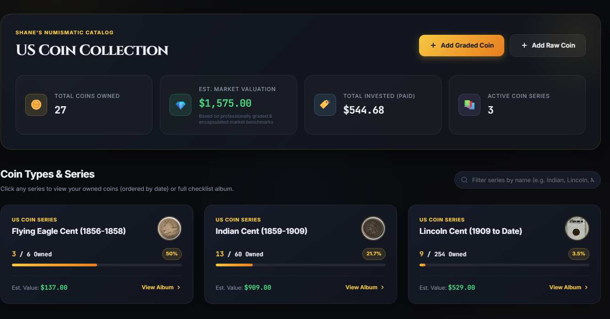
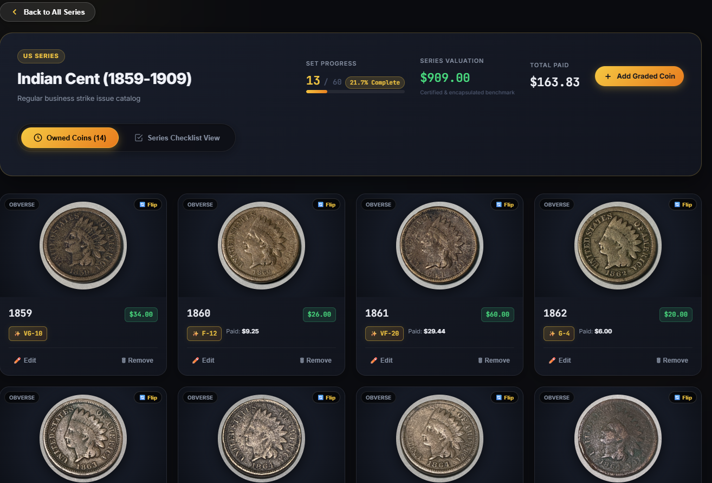
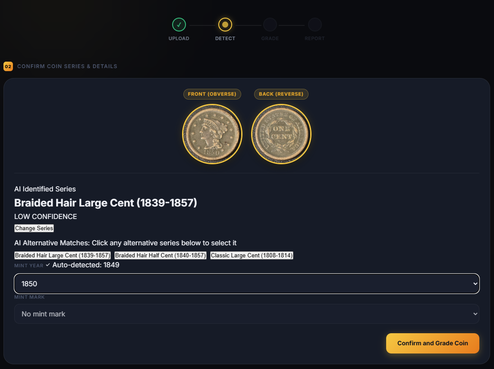
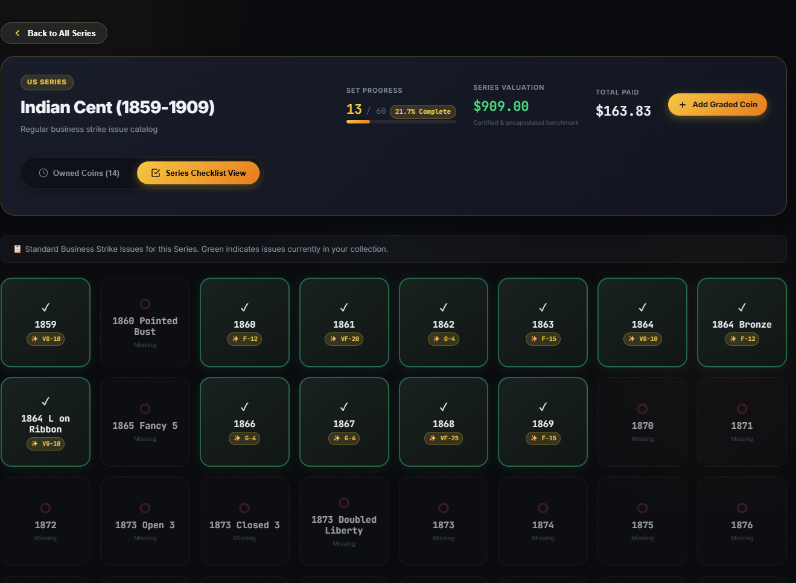
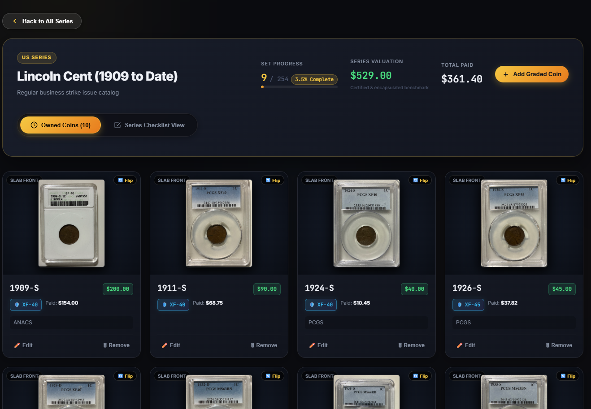

# 🪙 NumiStack — US Coin Collection Catalog & AI Numismatic Grader


**NumiStack** is a modern, privacy-focused desktop cataloging application and AI-powered numismatic grading suite built for US coin collectors. It allows you to organize your collection by series, track valuations and acquisitions, and grade raw coins using multi-view vision AI models directly on your machine.

---
## 📸 App Previews
<p align="center">
  
  
  
</p>
<p align="center">
  
  
  
</p>

## ✨ Key Features

- 📚 **Comprehensive US Coin Cataloging**
  - Track owned coins sorted by date, mint mark, variety, strike character, and purchase history.
  - Complete series album checklists showing collection set completion percentages.
  - Portfolio valuation dashboard tracking market values against purchase prices.

- 🤖 **Local AI Numismatic Grading Engine**
  - Multi-view visual analysis evaluating obverse (front) and reverse (back) high-resolution images.
  - Sheldon 1–70 grading scale estimates with breakdown metrics for details, wear, luster, and strike.
  - Runs locally on your machine—no external cloud processing required.

- 🔒 **Private & Secure Local Storage**
  - Password-protected local vault.
  - All images, databases, and records remain strictly on your local computer (`%LOCALAPPDATA%`).

- 🏷️ **Slab & Raw Coin Support**
  - **Add Graded Coin**: Fast cataloging for third-party certified slabs (PCGS, NGC, ANACS, CACG).
  - **Add Raw Coin**: AI coin detection, automatic cropping, identification, and instant grading assessment.

---
## 📥 Download & Installation
Because NumisStack bundles local AI neural networks and comprehensive price databases (~3 GB total), the installer is distributed in two parts:
### 1. Download Both Parts:
- 📦 [**Download Part 1 (NumisStack_Setup_v1.0.0.7z.001)**](https://github.com/shaneboss-hub/NumisStack/releases/download/v1.0.0/NumisStack_Setup_v1.0.0.7z.001) (~1.5 GB)
- 📦 [**Download Part 2 (NumisStack_Setup_v1.0.0.7z.002)**](https://github.com/shaneboss-hub/NumisStack/releases/download/v1.0.0/NumisStack_Setup_v1.0.0.7z.002) (~1.5 GB)
### 2. Extract and Install:
1. Save both files in the **same folder** (e.g. your Downloads folder).
2. Right-click `NumisStack_Setup_v1.0.0.7z.001` $\rightarrow$ select **7-Zip** (or WinRAR) $\rightarrow$ **Extract Here**.  
   *(If you need 7-Zip, download it free from [7-zip.org](https://www.7-zip.org/)).*
3. Double-click the extracted **`NumisStack_Setup_v1.0.0.exe`** and follow the setup wizard.
4. Launch **NumisStack** from your Desktop shortcut or Start Menu!

   
**System Requirements:**
Windows 10 or Windows 11 (64-bit)
4 GB RAM minimum (8 GB recommended for faster AI grading)
~4.5 GB free disk space


## 🚀 Quick Start Guide

1. **Create Your Collector Profile:**
   - Launch NumiStack for the first time, choose your collector name, and set a password for your vault.
   - Review and accept the legal disclaimer.
2. **Add Your First Coin:**
   - Click **`+ Add Raw Coin`** to upload front and back photos for AI grading and cataloging.
   - Click **`+ Add Graded Coin`** to quickly log a slabbed coin by selecting the grading service and certified grade.
3. **Explore Your Collection:**
   - Browse by coin series (e.g. Indian Cents, Lincoln Cents, Morgan Dollars, etc.), view your owned coins sorted chronologically, and check your progress on the series checklist.

---
## 📱 Connecting from Your Phone over Local Wi-Fi (LAN)
You can use your smartphone (iPhone or Android) to photograph and add coins directly to your collection while NumiStack is running on your PC:
1. **Ensure Both Devices Are on the Same Wi-Fi Network**: Connect your smartphone to the same home Wi-Fi network as your computer.
2. **Find Your PC's Local IP Address**:
   - On Windows, open Command Prompt or PowerShell and type `ipconfig`.
   - Look for the **IPv4 Address** under your active Wi-Fi or Ethernet adapter (e.g., `192.168.1.45`).
3. **Open the App in Your Mobile Browser**:
   - On your phone's browser (Safari, Chrome, etc.), navigate to:
     ```text
     http://<YOUR_PC_IP>:8000
     ```
     *(Example: `http://192.168.1.45:8000`)*
4. **Log In and Start Cataloging**:
   - Enter your vault credentials.
   - Tap **`+ Add Raw Coin`** $\rightarrow$ choose your phone's camera to capture front and back photos directly from your desk!
> **Note**: If your phone cannot connect, make sure Windows Defender Firewall allows incoming connections on port `8000`, or select "Allow" if prompted when launching the app.
---
## ☕ Support the Project
If you find NumiStack helpful for cataloging and grading your coin collection, consider supporting future development:
<a href="https://buymeacoffee.com/NumisStack" target="_blank">
  
</a>
---

## 🐛 Feedback & Bug Reports
Found an issue or have a feature suggestion?
Please submit a ticket via our [GitHub Issues](https://github.com/NumisStack/NumiStack/issues) page.
---

## ⚠️ Legal Disclaimer

The grading and identification features provided by NumiStack use artificial intelligence and image analysis and are intended for informational and educational purposes only. AI-generated grades are **estimates and are not equivalent to an examination or grade issued by a professional numismatist or third-party grading service (TPGS)**.

Any values displayed are **estimates only**, derived from reference data and market benchmarks. They are not appraisals, guarantees of value, or investment advice. Always consult a certified professional numismatist or recognized grading service (such as PCGS, NGC, or CACG) for coins of significant value.

---


